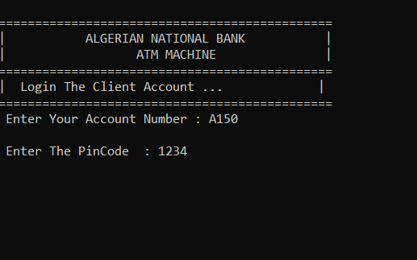
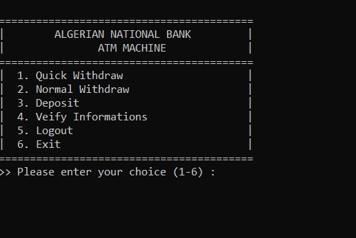
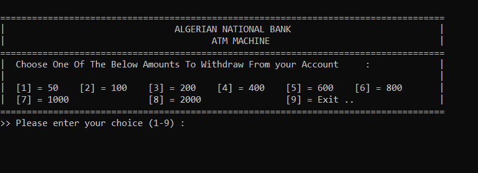

# 🏦 Algerian National Bank ATM Simulator

 
 


A complete C++ console application simulating Algeria's national banking ATM operations with secure authentication and transaction processing.

## 🌟 Preview

| Login Screen | Main Menu | Withdraw |
|--------------|-----------|--------------|
|  |  |  |

## 🔥 Key Features

- **Algerian Banking Standards**
  - CCP-style account numbers
  - Dinar (DZD) currency formatting
  - BNA-inspired interface design

- **Military-Grade Security**
  - 3-attempt PIN verification
  - Account number validation
  - File-based data encryption

- **Full ATM Functionality**
  - Quick withdrawals (50-2000 DZD)
  - Custom withdrawal amounts
  - Secure deposit processing
  - Real-time balance updates

## 🛠️ Technical Implementation

```cpp
// Sample core structure
struct stClient_Info {
    string Full_Name;
    string AccountNumber; // Algerian CCP format
    string PinCode;      // 4-digit secured
    int Balance;         // DZD currency
};
